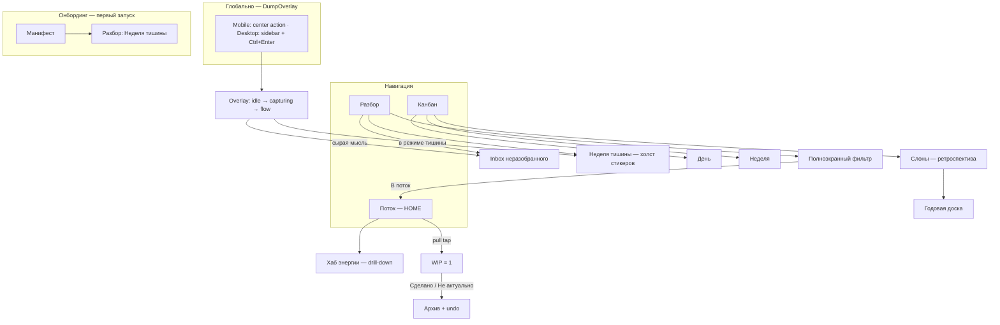
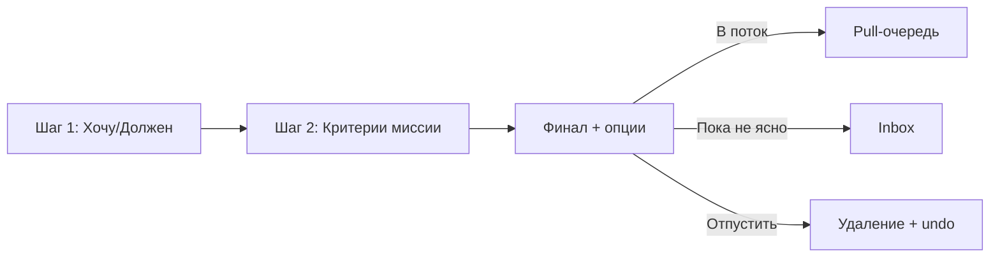
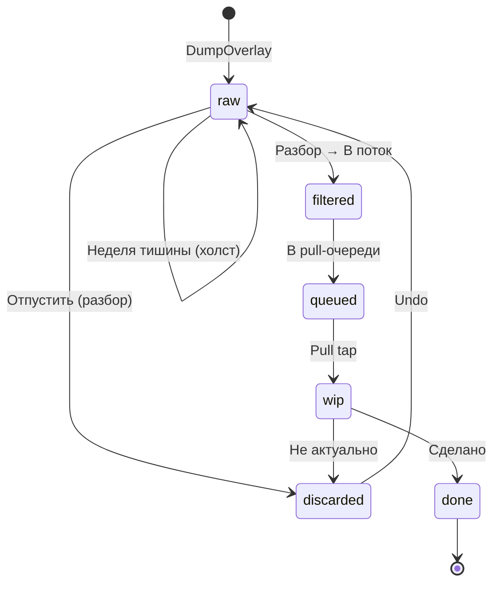

# KaizenFlow — UI Shell & Information Architecture

**Дата:** 2026-06-07  
**Статус:** согласовано (design grill, 40 решений)  
**Источник истины по фичам:** [context/IDEA.md](../../../context/IDEA.md)  
**Дорожная карта:** [2026-06-07-kaizenflow-roadmap.md](./2026-06-07-kaizenflow-roadmap.md)  
**Конвенции разработки:** [AGENTS.md](../../../AGENTS.md)

---

## Цель документа

Зафиксировать целевую информационную архитектуру и UX-паттерны KaizenFlow после абстрагирования от текущего split-view (сайдбар «Выгрузить» + холст). Документ — источник истины для реализации навигации (S2), экранов модулей и визуального языка карточек.

**Не входит в scope:** pixel-perfect wireframes, API персистентности, технический план реализации (отдельный implementation plan).

---

## Ключевые продуктовые решения

### Shell & навигация (Q1–14)

| # | Вопрос | Решение |
|---|--------|---------|
| 1 | Где пользователь проводит основное время | **В потоке работы** — канбан, фильтры, энергия (сессии 10–60 мин) |
| 2 | Первый кадр при открытии | **Дашборд «Поток»** — WIP + pull-очередь + снимок энергии |
| 3 | Навигация между модулями | **3 вкладки** (Поток · Разбор · Канбан) + drill-down; энергия — не вкладка |
| 4 | Выгрузка мысли | **Глобальный захват** → overlay / bottom sheet (см. Q39–40: не floating FAB) |
| 5 | Целевое устройство | **Mobile-first PWA**; десктоп — graceful degradation |
| 6 | Вкладка «Разбор» | **Inbox + полноэкранный фильтр**; холст — только «Неделя тишины» |
| 7 | Блок энергии на дашборде | **Индикатор + строка совета**; полный хаб — по тапу |
| 8 | Вкладка «Канбан» (mobile) | **День + неделя**; месяц/год — ретроспектива «Слонов» |
| 9 | Визуальный язык карточки | **Два режима:** стикер (сырое) → ровная карточка (поток) |
| 10 | Pull в WIP | **Тап** по карточке очереди; gate при занятом WIP |
| 11 | Завершение WIP | **«Сделано»** или **«Не актуально»** (undo); оба освобождают слот |
| 12 | «Неделя тишины» | **Онбординг + ручной переключатель**; вкладки приглушены, доступны |
| 13 | Визуальный тон | **Цифровой UI** на потоке; dot-grid и стикеры — только в тишине |
| 14 | Пустой «Поток» | **«Поток свободен»** + одна мягкая подсказка при необходимости |

### Онбординг, энергия, фильтр (Q15–24)

| # | Вопрос | Решение |
|---|--------|---------|
| 15 | Первый запуск до выгрузки | **Манифест** — 2–3 предложения философии + «Начать»; без тура |
| 16 | После «Начать» | **«Разбор»** в режиме «Недели тишины» — холст + center action с подсказкой |
| 17 | Ввод энергии в хабе | **Пресеты** «Бодрый · Средне · На нуле» + «Точнее» → ползунки |
| 18 | Шаг «Хочу / Должен» | **Swipe** ← Должен · Хочу →; tap «Не знаю»; подсказка на первых 3 карточках |
| 19 | Шаг «Миссия и Цели» | **Три действия** на финале критериев: В поток · Пока не ясно · Отпустить (undo) |
| 20 | Свои критерии фильтра | **Гибрид:** дефолты + свои (до 5); **1 критерий = 1 экран** |
| 21 | Дефолтные критерии | **Личная миссия** пользователя; fallback — «Стоит ли это моей энергии?» |
| 22 | Когда собирать миссию | При первом **«Готов разбирать»** — выход из «Недели тишины» |
| 23 | Предохранитель воли | **Комбо:** «На нуле» + тяжёлый pull → диалог; ≥3 тяжёлых завершения за ~2 ч → экран «Пауза»; override всегда |
| 24 | «Инвестиции времени» | **Опционально** на финальном экране фильтра (горизонтальный scroll тегов); можно пропустить |

### Энергозатратность, калькулятор, ретроспектива (Q25–29)

| # | Вопрос | Решение |
|---|--------|---------|
| 25 | Энергозатратность карточки | **Chips** на финале фильтра: Лёгкое · Среднее · Тяжёлое; пропуск = Среднее |
| 26 | Калькулятор «Результат / Затраты» | **По запросу** — ссылка при «Тяжёлое»; не блокирует «В поток» |
| 27 | Ретроспектива «Слонов» | **Badge + optional push**; guided flow 3 экрана; пропуск → авто-перенос |
| 28 | Годовая доска | **Список 12 месяцев** + tap → read-only лента достижений; «музей побед» |
| 29 | Детектор заторов | **Amber-обводка** на канбане + **одна строка** на «Потоке»; tap → bottom sheet |

### Push, desktop, редактирование (Q30–33)

| # | Вопрос | Решение |
|---|--------|---------|
| 30 | Push-уведомления | **Настраиваемые типы**; дефолт вкл: утро, затор, слоны; выкл: «давно не заходил», энергия |
| 31 | Desktop layout | **Двухколоночный** «Поток» и «Разбор»; канбан на полную ширину; overlay — модалка |
| 32 | Редактирование карточки | **Tap → sheet** (pull/WIP/канбан); inbox — tap = inline edit; double-click только на холсте тишины |
| 33 | Разрешение на push | **Только** при включении первого toggle в настройках; pre-prompt; без prompt при онбординге |

### Жесты и navigation chrome (Q34–40)

| # | Вопрос | Решение |
|---|--------|---------|
| 34 | Pull-очередь: pull vs edit | **Tap = pull**; **«⋯» = sheet**; long press не используем |
| 35 | WIP: завершение vs edit | **Две кнопки** «Сделано» · «Не актуально» под карточкой; «⋯» = edit |
| 36 | Пустой WIP-слот | **Плейсholдер** + подсветка очереди + «Можно начать с: [карточка]» (tap = pull) |
| 37 | Inbox «Разбор»: tap | **Tap = inline edit**; кнопка **«Разобрать»** → фильтр |
| 38 | Канбан: перемещение | **Mobile:** tap → sheet «Переместить в…»; **Desktop:** drag; WIP-gate на «В работе» |
| 39 | Выгрузка на маленьком экране | **Center action** в tab bar (не floating FAB): Поток · ◉ · Разбор · Канбан |
| 40 | Выгрузка на desktop | **Sidebar:** accent-кнопка «Выгрузить» + **Ctrl+Enter**; center action только mobile |

---

## Сдвиг от текущего UI

| Сейчас | Целевое состояние |
|--------|-------------------|
| Split-view: `DumpPanel` (360px) + `Canvas` всегда виден | Shell: tab bar + center action (mobile) / sidebar (desktop); одна вкладка за раз |
| Холст — главное пространство | Дашборд «Поток» — home screen |
| Стикеры на всех этапах | Стикер только для сырого / «Недели тишины» |
| Dot-grid на холсте постоянно | Dot-grid только в режиме «Неделя тишины» |
| Desktop-ориентированный layout | Mobile-first; десктоп расширяет те же экраны |

---

## Архитектура навигации



### Вкладки

| Вкладка | Роль | Drill-down |
|---------|------|------------|
| **Поток** | Home. WIP, pull-очередь, энергия-снимок, nudge заторов | Хаб энергии |
| **Разбор** | Inbox + фильтрация; холст в «Неделе тишины» | Полноэкранный фильтр; экран миссии |
| **Канбан** | День и неделя; детектор заторов | «Слоны» → годовая доска |

Энергия **не** отдельная вкладка — контекст потока, доступный с дашборда.

---

## Онбординг

### Поток первого запуска

```
Манифест → «Начать» → «Разбор» (Неделя тишины) → center action «Выгрузи первую мысль»
         ↓
    … дни выгрузки на холст …
         ↓
«Готов разбирать» → экран миссии (1 строка, можно пропустить) → Inbox + фильтр
```

### Манифест (первый экран)

- 2–3 предложения философии: «освободи голову → потом разберёшь».
- Одна кнопка **«Начать»**.
- Без интерактивного тура, без выбора режима.

### Landing после «Начать»

- Вкладка **«Разбор»** в режиме **«Недели тишины»** (автоматически).
- Холст со стикерами + center action с подсказкой «Выгрузи первую мысль».
- Вкладки «Поток» и «Канбан» **приглушены**, но доступны.

### Экран миссии

- Появляется при первом нажатии **«Готов разбирать»** (выход из тишины).
- Одно поле: «Что для тебя сейчас главное?» — можно **пропустить**.
- Если задана → дефолтный критерий фильтра: «Это про **[миссия]**?»
- Если пропущена → fallback-критерий: «Стоит ли это моей энергии?»
- Изменить миссию можно позже в настройках «Разбора».

---

## Экраны и поведение

### Глобальный захват (`DumpOverlay`)

Один компонент overlay, три trigger:

| Платформа | Trigger |
|-----------|---------|
| **Mobile** (<768px) | **Center action** в tab bar — приподнятая кнопка «Выгрузить» между вкладками; не переключает вкладку |
| **Desktop** (≥768px) | Accent-кнопка **«Выгрузить»** вверху sidebar + **Ctrl+Enter** |

**Поведение overlay:**

- **Mobile:** bottom sheet (`idle → capturing → flow`), логика текущего `DumpPanel`.
- **Desktop:** центрированная модалка с тем же flow.
- Новая мысль → карточка `raw` → inbox «Разбора» (или холст при «Неделе тишины»).
- Успешная выгрузка → тактильный отклик (S4), когда API доступен.

**Mobile tab bar (4 touch targets):**

```
[ Поток ]  [ ◉ ]  [ Разбор ]  [ Канбан ]
            ↑
      DumpOverlay (не навигация)
```

Floating FAB **не используем** — center action в thumb zone без перекрытия контента.

### Вкладка «Поток» (home)

**Секции сверху вниз:**

1. **Энергия** — компактный индикатор (уровень/цвет) + одна строка совета. Тап → хаб энергии.
2. **WIP-слот** — одна структурированная карточка или пустой placeholder (см. ниже).
3. **Pull-очередь** — отфильтрованные карточки. Несовместимые с текущей энергией — **приглушены**, не скрыты.
4. **Nudge заторов** (при наличии) — одна мягкая строка: «N дел застряло — пересмотреть?»

**Pull-очередь (жесты):**

- **Tap** по карточке → pull в WIP; лёгкая вибрация.
- WIP занят → диалог: «Сначала завершить или отложить текущее?» Без guilt.
- **«⋯»** на карточке → sheet редактирования (текст, метаданные, «Разобрать заново»).
- Long press **не используем**.

**WIP-слот (жесты):**

- Карточка крупно по центру; **«⋯»** → sheet edit.
- Под карточкой две кнопки равного веса: **«Сделано»** (accent) · **«Не актуально»** (muted).
- **«Сделано»** → архив дня, вибрация.
- **«Не актуально»** → мягкое удаление + undo-тост.
- Оба освобождают WIP.

**Пустой WIP:**

- Пунктирная рамка + copy «Одно дело в единицу времени».
- Pull-очередь слегка **подсвечена**.
- Если есть подходящая карточка: «Можно начать с: [название]» — **tap = pull** (рекомендация, не auto-WIP).
- Очередь пуста → fallback empty state (см. ниже).

**Пустое состояние:**

- База: «Поток свободен».
- Если есть неразобранные: «N мыслей ждут разбора» → «Разбор».
- Иначе, если на неделе есть дела: «На неделе N дел готовы к вытягиванию».
- Не показывать обе подсказки; приоритет — неразобранное.

**Desktop:** WIP + pull слева; энергия + nudges справа. Те же правила.

### Вкладка «Разбор»

#### Обычный режим

**Inbox** — список карточек `raw`, по времени выгрузки.

**Inbox (жесты):**

- **Tap** → inline edit текста (сырой текст часто нужно дописать).
- Кнопка **«Разобрать»** на карточке → полноэкранный фильтр.
- **«⋯»** → sheet (удаление и прочее).

**Desktop:** inbox слева (click = edit); «Разобрать» → фильтр в правой панели (persistent, не overlay).

#### Pipeline фильтра (одна карточка)



**Шаг 1 — Хочу / Должен:**

- Swipe вправо → «Хочу»; влево → «Должен».
- Tap «Не знаю» снизу.
- Подсказка «← Должен · Хочу →» на первых 3 карточках, потом скрывается.
- Для accessibility — дублирующие кнопки (optional v1).

**Шаг 2 — Критерии миссии (1 экран = 1 критерий):**

- Дефолт: «Это про **[личная миссия]**?» → swipe да / нет / пропустить.
- Fallback (миссия не задана): «Стоит ли это моей энергии?»
- Пользовательские критерии: до **5 активных**; «+ Критерий» на шаге или в настройках.
- После всех критериев → финальный экран.

**Финальный экран:**

- **«В поток»** · **«Пока не ясно»** · **«Отпустить»** (undo).
- Опционально: горизонтальный scroll тегов «Куда инвестирую время» (дефолты + свои) — можно пропустить.
- Опционально: chips **«Лёгкое · Среднее · Тяжёлое»** — пропуск = «Среднее».
- При «Тяжёлое»: ссылка **«Оценить результат / затраты»** → калькулятор (не блокирует «В поток»).

**Калькулятор «Результат / Затраты» (по запросу):**

- Поля: «Что получу» · «Что отдам».
- Вердикт: да / сомневаюсь / нет.
- «Сомневаюсь» или «нет» → мягкое предложение «Отпустить» или «Пока не ясно».
- Результат сохраняется на карточке (виден в sheet по «⋯» в pull).

**После «В поток»:**

- Статус → `filtered`; визуально **ровная карточка** (не стикер).
- Попадает в pull-очередь «Потока».

#### Режим «Неделя тишины»

- Свободный **холст** (`Canvas` + `StickyNote`): dot-grid, наклон, drag.
- Планирование не навязывается.
- Выход: **«Готов разбирать»** → экран миссии → inbox + фильтр.

#### Вход в «Неделю тишины»

- Автоматически при онбординге (первый запуск).
- Ручное включение/выключение в любой момент.
- В режиме: «Канбан» и элементы разбора **приглушены**, доступны без guilt-текста.

### Вкладка «Канбан»

**Mobile — переключатель День · Неделя:**

- Горизонтальный скролл колонок.
- WIP-лимит «В работе» = 1 (technically enforced).

**Перемещение карточек:**

| Платформа | Жест |
|-----------|------|
| **Mobile** | Tap → sheet «Переместить в: [колонки]»; «Сделано» → вибрация |
| **Desktop** | Drag между колонками |
| **Оба** | «⋯» → sheet edit; попытка >1 в «В работе» → WIP-gate |

**Детектор заторов:**

- Порог: **≥5 дней** в колонке (не «В работе», не «Сделано»).
- На канбане: мягкая **amber-обводка** на карточке.
- На «Потоке»: одна строка-nudge (не banner).
- Tap на nudge → bottom sheet: **Пересмотреть** · **Перенести на след. неделю** · **Отпустить** (undo).

**Связь с «Потоком»:**

- «Поток» = сжатый вид **дня**.
- «Канбан» = zoom-out на **неделю**.

#### Ретроспектива «Слонов» (drill-down)

**Триггер:** badge на «Канбан» + optional push: «Месяц закрылся. Заглянуть в итоги?»

**Guided flow (3 экрана):**

1. **Сделано** — лента завершённого за месяц (мотивация, не KPI).
2. **Перенос** — невыполненное с чекбоксами (default: все); «Отпустить» на каждой.
3. **Слон месяца** — выбор одного главного достижения → годовая доска.

**Пропуск / «Позже»:** тихий авто-перенос на следующий месяц; badge остаётся.

#### Годовая доска (Канбан → Год)

- Read-only «музей побед».
- 12 месяцев: «Слон» + счётчик сделанного.
- Tap на месяц → лента достижений.
- Без drag, без WIP.
- Визуально чуть теплее обычного UI; не dot-grid стикеров.

### Хаб энергии (drill-down)

**Быстрый ввод (основной путь):**

- Пресеты: **«Бодрый» · «Средне» · «На нуле»** — один тап.
- **«Точнее»** → ползунки (v1: начать с 2 осей, расширить до 4 из IDEA).

**Предохранитель воли:**

- Пресет «На нуле» + pull **тяжёлой** карточки → диалог с лёгкими альтернативами из очереди.
- ≥3 **тяжёлых** завершения за ~2 ч → экран «Пауза» с идеями восстановления.
- Всегда кнопка **«Всё равно продолжу»** — без guilt, без jail.
- Copy: «Похоже, ресурс на исходе. Хочешь передышку?»

**Калькулятор «Результат / Затраты»:**

- Доступен из фильтра (при «Тяжёлое») и из хаба как standalone-инструмент.
- Отдельный стор `useEnergyStore`; не смешивать с `useCardsStore`.

---

## Push-уведомления

**Философия:** не «сделай задачу X», а **приглашение открыть** нужный экран.

| Тип | Дефолт | Пример copy |
|-----|--------|-------------|
| Утро — выгрузка | вкл | «Утро. Хочешь выгрузить мысли?» |
| Затор | вкл | «Одно дело застряло — пересмотреть?» |
| Слоны (1-е число) | вкл | «Месяц закрылся. Заглянуть в итоги?» |
| Давно не заходил | выкл | — |
| Энергия | выкл | — |

- Каждый тип — **toggle + preview** текста в настройках.
- Утренний push — не раньше **8:00**, timezone пользователя.
- Отказ от push **не ломает** app: in-app badge и nudges на «Потоке» работают.

### Разрешение на push

- **Нет** системного prompt при онбординге.
- Блок **«Уведомления»** в настройках с toggles.
- Системный prompt — **только** при включении первого toggle.
- Pre-prompt: «Мы не напоминаем о задачах — только приглашаем выгрузить или пересмотреть затор».
- Отказ → toggles видны; push не работает; badge остаётся.

---

## Карта жестов

| Контекст | Главное действие | Вторичное |
|----------|------------------|-----------|
| Pull-очередь | Tap → pull | «⋯» → sheet |
| WIP | «Сделано» / «Не актуально» | «⋯» → sheet |
| Inbox | Tap → inline edit | «Разобрать» → фильтр; «⋯» → sheet |
| Фильтр Хочу/Должен | Swipe ← → | Tap «Не знаю» |
| Критерии миссии | Swipe да/нет/пропустить | — |
| Канбан mobile | Tap → «Переместить в…» | «⋯» → sheet |
| Канбан desktop | Drag | «⋯» → sheet |
| Холст тишины | Drag; double-click → edit | Center action / sidebar → выгрузка |

**Принцип:** главное действие — **один явный жест** (tap / кнопка / swipe в фильтре); вторичное — **«⋯»**. Long press не используем (кроме drag на desktop-канбане).

---

## Жизненный цикл карточки



### Расширение модели карточки

Текущая модель (`id`, `text`, `color`, `rotation`, `x`, `y`, `createdAt`) дополняется:

| Поле | Фаза | Назначение |
|------|------|------------|
| `status` | Shell | `raw` · `filtered` · `wip` · `done` · `discarded` |
| `wantMust` | 2 | `want` · `must` · `unknown` · null |
| `missionCriteriaResults` | 2 | `{ criterionId, answer }[]` |
| `timeInvestment` | 2 | тег «куда инвестирую время» (optional) |
| `energyCost` | 2/4 | `light` · `medium` · `heavy` (default: medium) |
| `resultEffort` | 2/4 | `{ gain, cost, verdict }` — optional |
| `kanbanColumn` | 3 | колонка на доске |
| `stuckSince` | 3 | timestamp для детектора заторов |

**Отдельно в сторе / настройках пользователя:**

| Поле | Назначение |
|------|------------|
| `personalMission` | 1 строка; собирается при «Готов разбирать» |
| `filterCriteria[]` | до 5 пользовательских критериев |
| `investmentTags[]` | дефолтные + пользовательские теги |

**Визуальное правило:** `rotation` и свободные `x`/`y` — только для `status === raw` на холсте тишины. После фильтрации — `rotation: 0`, позиция управляется layout'ом.

---

## Визуальный язык

### Два режима

| Контекст | Стиль | Компоненты |
|----------|-------|------------|
| **Сырой / тишина** | «Бумажный блокнот» | `StickyNote`, dot-grid, наклон, `STICKY_COLORS` |
| **Поток / разбор / канбан** | «Цифровой, чистый» | Ровные карточки, cream/white, без dot-grid |
| **Годовая доска** | «Музей побед» | Read-only, чуть теплее accent; без drag |

### Палитра

Без изменений — токены из `src/index.css`. Меняется **плотность и текстура**, не brand colors.

- Заторы: **amber-обводка** (не красный alarm).
- Pull приглушение по энергии: пониженная opacity, не скрытие.

### Анимации и тактильность

- Framer Motion, пружины — как в `StickyNote`.
- Вибрация: выгрузка, swipe-commit фильтра, pull в WIP, «Сделано».
- Тон — спокойный, русский, без давления.

---

## Desktop: graceful degradation

| Элемент | Mobile (<768px) | Desktop (≥768px) |
|---------|-----------------|------------------|
| Выгрузка | Center action в tab bar → bottom sheet | Sidebar accent «Выгрузить» + Ctrl+Enter → модалка |
| Навигация | Tab bar: Поток · ◉ · Разбор · Канбан | Sidebar слева: Выгрузить + 3 вкладки |
| «Поток» | Вертикальный stack | WIP + pull **\|** энергия + nudges (две колонки) |
| «Разбор» | Inbox full-width; фильтр fullscreen | Inbox **\|** фильтр (persistent panel) |
| «Канбан» | Tap → sheet «Переместить в…» | Drag между колонками; день/неделя на полную ширину |
| Редактирование | Tap → sheet; inbox tap → inline | Click → sheet / inline; «Разобрать» → правая панель |
| Годовая доска | Список месяцев | Сетка 3×4 или timeline |

Не возвращаться к permanent split-view «DumpPanel 360px + Canvas».

---

## Маппинг на дорожную карту

| Элемент shell | Задача roadmap |
|---------------|----------------|
| Tab bar + routing | **S2** |
| `DumpOverlay` + navigation chrome (`DumpPanel` refactor) | **Фаза 1** |
| Онбординг + «Неделя тишины» | **Фаза 1** |
| Inbox + фильтр (swipe, критерии, теги, energy chips) | **Фаза 2** |
| Калькулятор «Результат/Затраты» | **Фаза 2** (лёгкая версия) / **Фаза 4** (полная) |
| «Поток» WIP + pull + empty states + nudge заторов | **Фаза 3** |
| «Канбан» день/неделя + детектор заторов | **Фаза 3** |
| «Слоны» + годовая доска | **Фаза 3** |
| Энергия-снимок + хаб + предохранитель | **Фаза 4** |
| `status`, `energyCost` на карточке | Shell → расширение по фазам |

### Рекомендуемый порядок реализации shell

1. **S1** — персистентность.
2. **Shell v1** — tab bar + center action + `DumpOverlay` + заглушки вкладок.
3. **Онбординг** — манифест + авто-«Неделя тишины».
4. **Фаза 1** — холст на «Разборе»; выход из тишины + экран миссии.
5. **Фаза 2** — inbox + фильтр pipeline; стикер → карточка.
6. **«Поток» v1** — WIP + pull + empty states.
7. **Фаза 3** — канбан, заторы, «Слоны», годовая доска.
8. **Фаза 4** — энергия, предохранитель, полный хаб.
9. **S3 + S4** — PWA + тактильность + push (после настроек уведомлений).

---

## Критерии готовности (shell)

- [ ] Первый запуск: манифест → «Разбор» в «Неделе тишины».
- [ ] Повторный запуск: home = **«Поток»**.
- [ ] Три вкладки; переходы быстрые, без шума.
- [ ] Выгрузка: center action (mobile) / sidebar + hotkey (desktop); overlay: `idle / capturing / flow`.
- [ ] «Разбор» обычный — inbox (tap = edit, «Разобрать» = фильтр); тишина — холст.
- [ ] «Готов разбирать» → экран миссии → фильтр.
- [ ] Фильтр: swipe Хочу/Должен, критерии, финал с тегами и energy chips.
- [ ] WIP = 1; pull по тапу с gate; «⋯» = sheet; пустой WIP с рекомендацией.
- [ ] «Сделано» / «Не актуально» под WIP + undo.
- [ ] Канбан: mobile sheet / desktop drag; WIP-gate на «В работе».
- [ ] Карта жестов согласована; long press не используем (кроме desktop drag).
- [ ] Push: toggles в настройках; prompt только при первом включении.
- [ ] Два визуальных режима карточки различимы.
- [ ] Dot-grid только на холсте тишины.
- [ ] Заторы: amber на канбане + nudge на «Потоке».
- [ ] Mobile-first; десктоп не ломает layout.
- [ ] Инварианты AGENTS.md соблюдены.

---

## Открытые вопросы (для impl. plan)

- Финальный copy манифеста и tab bar labels.
- Точные пороги предохранителя воли (число тяжёлых завершений, окно времени).
- Дефолтный набор тегов «Инвестиции времени».
- IndexedDB vs localStorage для S1.
- Иконки вкладок и center action.
- Sidebar: collapsed (icons only) vs expanded на desktop.
- Accessibility: дублирующие кнопки вместо swipe в фильтре (optional v1).
